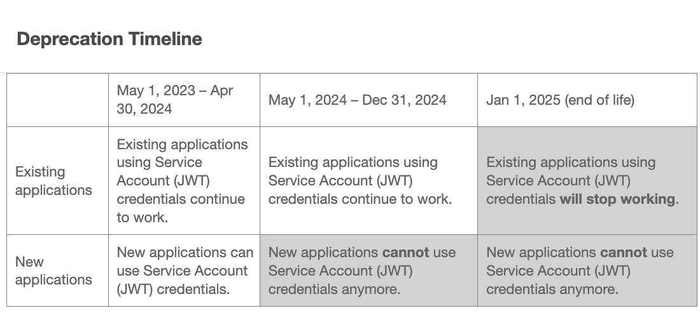
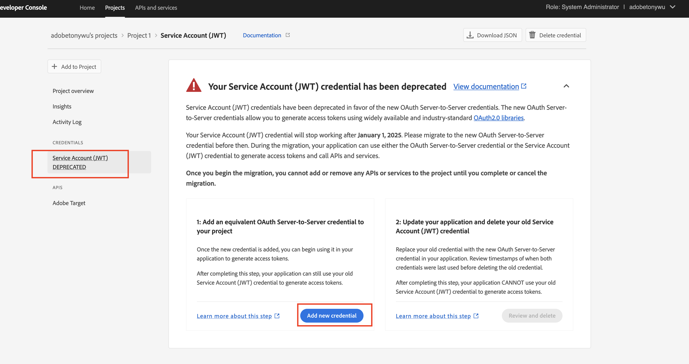
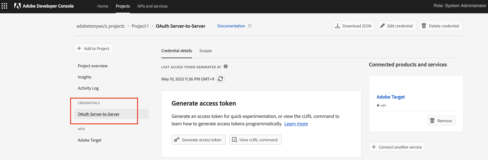

# Schrittweise Anleitung für die Migration von Berechtigungen von JWT zu OAuth Server zu Server

## Beschreibung {#description}

Schrittweise Anleitung für die Migration von Berechtigungen von JWT zu OAuth Server zu Server     <b>Hintergrund:</b>
    Die Berechtigung für Dienstkonten (JWT) wurde zugunsten der neuen OAuth Server-zu-Server-Berechtigung eingestellt.  Die neuen Anmeldedaten erleichtern Ihnen die Entwicklung und Pflege von Adobe Apps.  Außerdem entfällt die Notwendigkeit, Zertifikate regelmäßig zu drehen, und es werden native Funktionen mit standardmäßigen OAuth2-Bibliotheken verwendet. 

<b>Hinweis: Keine Ihrer laufenden Adobe-Anwendungen oder -Integrationen wird bis zum 1. Januar 2025 unterbrochen.</b>        <b></b>      

## Auflösung {#resolution}

I. Melden Sie sich bei der Adobe Developer-Konsole an ([https://developer.adobe.com/console](https://developer.adobe.com/console)) .

II. Wählen Sie links im Filtermenü die Option &quot;Berechtigung für Dienstkonto (JWT) vorhanden&quot;aus.
 Auf diese Weise werden alle Projekte angezeigt, die über eine JWT-Berechtigung (Service Account) verfügen.
 

III. Klicken Sie auf die Schaltfläche &quot;Neue Berechtigung hinzufügen&quot;, um die Migration zu starten.

IV.  Die neue Berechtigung &quot;OAuth Server-to-Server&quot;wurde auf der linken Seite hinzugefügt.

a. Klicken Sie auf &quot;Migration abbrechen&quot;, wenn Sie die Migration abbrechen müssen.
b. Klicken Sie auf die Schaltfläche &quot;Überprüfen und Löschen&quot;, nachdem Sie überprüft haben, ob die neue Berechtigung &quot;OAuth Server-to-Server&quot;ordnungsgemäß funktioniert und wann Sie die JWT-Berechtigung löschen möchten, um die Migration abzuschließen.
 

V.  Aktualisieren Sie den Code der Kundenanwendung mit der OAuth2.0-Bibliothek, um das Zugriffstoken mit den neuen Anmeldedaten zu generieren.

1. [PassportJS](https://github.com/jaredhanson/passport) (Node.js)
2. [Frühlingssicherheit](https://spring.io/projects/spring-security) (Java)
3. [Authlib](https://github.com/lepture/authlib) (Python)
4. Weitere Bibliotheken anzeigen unter  [https://oauth.net/code/](https://oauth.net/code/)

VI.  Überprüfen Sie den Zeitstempel des Menüs Letzter Zugriff oder Letzte Verwendung , um die von der Kundenanwendung erstellten Zugriffstoken mithilfe der neuen Berechtigung zu überprüfen.

VII. Nachdem Sie die alte Berechtigung erfolgreich ersetzt haben, fahren Sie mit dem letzten Schritt zum Löschen der alten Berechtigung fort.

VIII. Jetzt bleibt nur die neue Berechtigung für OAuth Server-to-Server auf der linken Seite, wenn die Migration abgeschlossen ist.

 
 
<b>Referenzdokumente</b>
Um sicherzustellen, dass Ihre Anwendung nach dem 1. Januar 2025 weiterhin funktioniert, müssen Sie sie migrieren, um die neuen OAuth Server-zu-Server-Anmeldeinformationen zu verwenden. Der Migrationsprozess ist einfach und ermöglicht eine Migration ohne Ausfallzeiten. Weitere Informationen finden Sie in unserer Dokumentation . 
1. [Migration von JWT-Anmeldedaten (Service Account)](https://nam04.safelinks.protection.outlook.com/?url=https%3A%2F%2Fpostoffice.adobe.com%2Fpo-server%2Flink%2Fredirect%3Ftarget%3DeyJhbGciOiJIUzUxMiJ9.eyJ0ZW1wbGF0ZSI6ImJsZXRoZXJfbm90aWNlX29hdXRoX3NlcnZlcl90b19zZXJ2ZXIiLCJlbWFpbEFkZHJlc3MiOiJndXd1K3NvbmVAYWRvYmV0ZXN0LmNvbSIsInJlcXVlc3RJZCI6IjM0ZjIyNTMwLThjMzEtNDlkNC1iZjEyLThlZGIyY2E0ODdhOCIsImxpbmsiOiJodHRwczovL3d3dy5hZG9iZS5jb20vZ28vZGV2c19zMnNfbWlncmF0aW9uX2d1aWRlIiwibGFiZWwiOiI5IiwibG9jYWxlIjoiZW5fVVMifQ.Pr8LjAW5wq_tEqCQLs4Y2fwJSTW_Z2FH0CIVInolEKvySfPDiF7vl8Hg4S9ne_V6a74oLfCVzc99EE9K4XUoBQ&amp;amp;data=05%7C01%7Cguwu%40adobe.com%7C3b1b2261ea264d45d9df08db4ce8a7de%7Cfa7b1b5a7b34438794aed2c178decee1%7C0%7C0%7C638188334359675040%7CUnknown%7CTWFpbGZsb3d8eyJWIjoiMC4wLjAwMDAiLCJQIjoiV2luMzIiLCJBTiI6Ik1haWwiLCJXVCI6Mn0%3D%7C3000%7C%7C%7C&amp;amp;sdata=dd8x%2FoDHh0QUi3xboxa78uA54JXEaVq5qYkP8zkvymk%3D&amp;amp;reserved=0)
2. [Verwenden der neuen OAuth Server-zu-Server-Anmeldedaten](https://nam04.safelinks.protection.outlook.com/?url=https%3A%2F%2Fpostoffice.adobe.com%2Fpo-server%2Flink%2Fredirect%3Ftarget%3DeyJhbGciOiJIUzUxMiJ9.eyJ0ZW1wbGF0ZSI6ImJsZXRoZXJfbm90aWNlX29hdXRoX3NlcnZlcl90b19zZXJ2ZXIiLCJlbWFpbEFkZHJlc3MiOiJndXd1K3NvbmVAYWRvYmV0ZXN0LmNvbSIsInJlcXVlc3RJZCI6IjM0ZjIyNTMwLThjMzEtNDlkNC1iZjEyLThlZGIyY2E0ODdhOCIsImxpbmsiOiJodHRwczovL3d3dy5hZG9iZS5jb20vZ28vZGV2c19zMnNfY3JlZGVudGlhbF9vdmVydmlldyIsImxhYmVsIjoiMTAiLCJsb2NhbGUiOiJlbl9VUyJ9.c-c4—RAgDvS0l-WI5yIuYBIbzL7OeWXepCCfSzR1AkdVnrTZmWmm7jYmu11JqHZ_UBPANJqYEzEZrtydXY0Y Q&amp;amp;data=05%7C01%7Cguwu%40adobe.com%7C3b1b2261ea264d45d9df08db4ce8a7de%7Cfa7b1b5a7b343879 4aed2c178decee1%7C0%7C0%7C638183334359675040%7CUnknown%7CTWFpbGZsb3d8eyJWIjoiMC4wLW jAwMDAiLCJQIjoiV2luMzIiLCJBTiI6Ik1haWwiLCJXVCI6Mn0%3D%7C3000%7C%7C%7C&amp;amp;sdata=YwiTIXMxPv MhhEhVR3sv0g%2Bqi4NP8OERnJxE9C65I0%3D&amp;amp;reserviert=0)
3. [ Häufig gestellte Fragen (FAQ) ](https://nam04.safelinks.protection.outlook.com/?url=https%3A%2F%2Fpostoffice.adobe.com%2Fpo-server%2Flink%2Fredirect%3Ftarget%3DeyJhbGciOiJIUzUxMiJ9.eyJ0ZW1wbGF0ZSI6ImJsZXRoZXJfbm90aWNlX29hdXRoX3NlcnZlcl90b19zZXJ2ZXIiLCJlbWFpbEFkZHJlc3MiOiJndXd1K3NvbmVAYWRvYmV0ZXN0LmNvbSIsInJlcXVlc3RJZCI6IjM0ZjIyNTMwLThjMzEtNDlkNC1iZjEyLThlZGIyY2E0ODdhOCIsImxpbmsiOiJodHRwczovL3d3dy5hZG9iZS5jb20vZ28vZGV2c19zMnNfbWlncmF0aW9uX2d1aWRlX2ZhcSIsImxhYmVsIjoiMTEiLCJsb2NhbGUiOiJlbl9VUyJ9.8IlQUL_WbLKsMUDG4VHvqnwqI0l6TzEXSN0I_R_dXCswvDQpusEgm5LstaLYWzPy0crhk_ShRbmjZvMVS5t1Mg&amp;amp;data=05%7C01%7Cguwu%40adobe.com%7C3b1b2261ea264d45d9df08db4ce8a7de%7Cfa7b1b5a7b34438794aed2c178decee1%7C0%7C0%7C638188334359675040%7CUnknown%7CTWFpbGZsb3d8eyJWIjoiMC4wLjAwMDAiLCJQIjoiV2luMzIiLCJBTiI6Ik1haWwiLCJXVCI6Mn0%3D%7C3000%7C%7C%7C&amp;amp;sdata=n4WBY0gemPujdOZRaTMICsePuQJsuh9STbkgEsvyai8%3D&amp;amp;reserved=0)

Wenden Sie sich bei Fragen an Ihren Kundenbetreuer oder an den Support oder besuchen Sie die Adobe Developer Console. [forums](https://nam04.safelinks.protection.outlook.com/?url=https%3A%2F%2Fpostoffice.adobe.com%2Fpo-server%2Flink%2Fredirect%3Ftarget%3DeyJhbGciOiJIUzUxMiJ9.eyJ0ZW1wbGF0ZSI6ImJsZXRoZXJfbm90aWNlX29hdXRoX3NlcnZlcl90b19zZXJ2ZXIiLCJlbWFpbEFkZHJlc3MiOiJndXd1K3NvbmVAYWRvYmV0ZXN0LmNvbSIsInJlcXVlc3RJZCI6IjM0ZjIyNTMwLThjMzEtNDlkNC1iZjEyLThlZGIyY2E0ODdhOCIsImxpbmsiOiJodHRwczovL2V4cGVyaWVuY2VsZWFndWVjb21tdW5pdGllcy5hZG9iZS5jb20vdDUvYWRvYmUtZGV2ZWxvcGVyLWNvbnNvbGUvY3QtcC9hZG9iZS1pby1jb25zb2xlIiwibGFiZWwiOiIxMiIsImxvY2FsZSI6ImVuX1VTIn0.P8FY77-eRzVSjnf09no_Hn5owFmpREoMVLK5OSTU6WWBApUGuQH0fokMAu1R0L-uTQlCovlnIGYD7NRoqMFD8g&amp;amp;data=05%7C01%7Cguwu%40adobe.com%7C3b1b2261ea264d45d9df08db4ce8a7de%7Cfa7b1b5a7b34438794aed2c178decee1%7C0%7C0%7C638188334359675040%7CUnknown%7CTWFpbGZsb3d8eyJWIjoiMC4wLjAwMDAiLCJQIjoiV2luMzIiLCJBTiI6Ik1haWwiLCJXVCI6Mn0%3D%7C3000%7C%7C%7C&amp;amp;sdata=%2FhbICP9PCZsfsNDrBYaGlEb%2FREbBJMjNZeWPzoOPJsk%3D&amp;amp;reserved=0).
