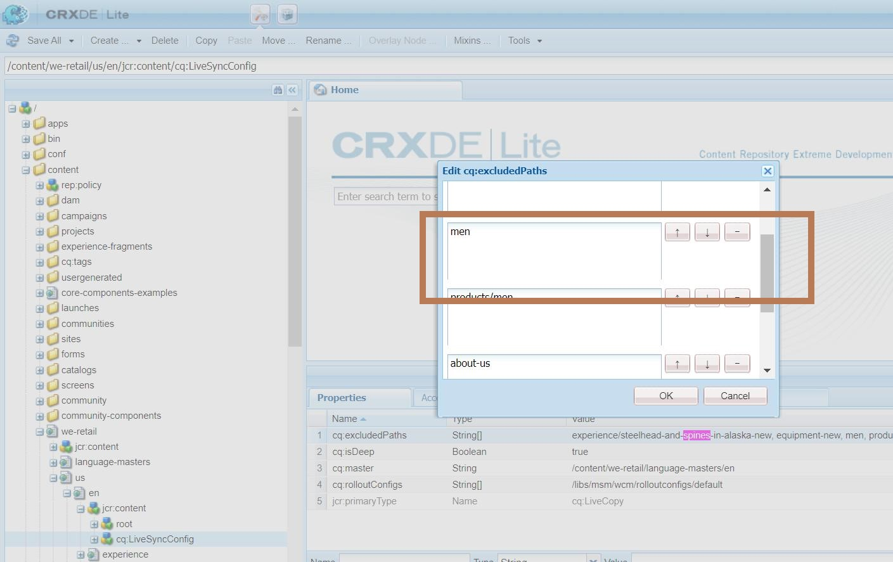

# AEM: Durchführen des Rollouts einer gelöschten Live Copy

## Beschreibung {#description}

### <b>Umgebung</b>

- AEM 6.5
- Experience Manager

### <b>Problem/Symptome</b>

Wenn Sie eine Live Copy-Seite löschen, ohne sie zu trennen, wird sie vom Rollout ausgeschlossen. In diesem Artikel wird erläutert, wie Sie die Seite erneut einführen.

## Auflösung {#resolution}

Eine Stammseite von Live Copy verfügt über die folgende &#x200B;, um den Rollout auszuschließen.

<b>Knoten:</b> <b>{Stamm der Live Copy-Seite}/jcr:content/cq:LiveSyncConfig-Eigenschaften: cq:excludedPaths (String)`[` `]` )</b>

Wenn Sie eine Live Copy-Seite ohne &quot;Trennen&quot;löschen, wird der gelöschte Seitenname der Eigenschaft hinzugefügt und aus dem Rollout ausgeschlossen.
Daher muss das Entfernen des gelöschten Seitennamen aus der Eigenschaft ihn in den Rollout aufnehmen.

<b>Beispiel:</b>
Wenn die folgende Seite im &quot;We-Retail&quot;vor &quot;Trennen&quot;gelöscht wird, wird &quot;Herren&quot;zum <b>cq:excludedPaths </b>Eigenschaftswert in den Live Sync-Einstellungen.
Sie können die Seite in das Rollout für die Seite einbeziehen, indem Sie CRX/DE Lite aufrufen und &quot;Männer&quot;aus<b> cq:excludedPaths</b>

Gelöschte Seite:<b>/content/we-retail/us/en/men </b>
Live Copy der Stammseite:<b>/content/we-retail/us/en</b>
Einstellungen für die Live-Synchronisierung:<b>/content/we-retail/us/en/jcr:content/cq:LiveSyncConfig</b>

