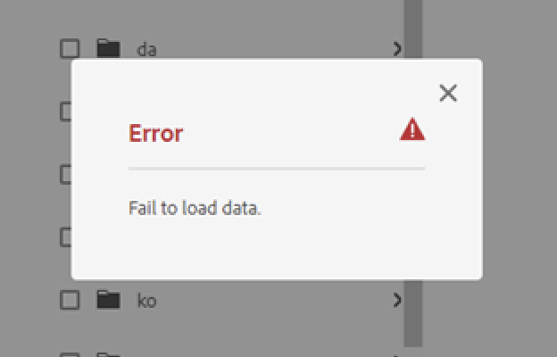

# Das Hinzufügen von Assets zu einem Übersetzungsauftrag schlägt mit der Fehlermeldung &quot;Daten werden nicht geladen&quot;fehl

## Beschreibung {#description}

.lf-progress { width: 100 %; height: 4px; border-radius: 3px; Cursor: pointer } .lf-progress:focus { entwurf: keine; border: none } .lf-progress::-moz-range-track { cursor: Zeiger; background: keine; border: keine; entwurf: none } .lf-progress::-webkit-regler-thumb { height: 13px; width: 13px; border: 0; border-radius: 50 %; background: rgba(15, 204, 206, 1); Cursor: pointer } .lf-progress::-moz-range-thumb { height: 13px; width: 13px; border: 0; border-radius: 50 %; background: rgba(15, 204, 206, 1); Cursor: pointer } .lf-progress::-ms-track { width: 100 %; height: 3px; Cursor: Zeiger; background: rgba(0, 0, 0, 0); border-color: rgba(0, 0, 0, 0); color: rgba(0, 0, 0, 0) } .lf-progress::-ms-fill-lower { background: rgba(204, 204, 204, 1); border-radius: 3px } .lf-progress::-ms-fill-upper { background: rgba(204, 204, 204, 1); border-radius: 3px } .lf-progress::-ms-thumb { border: 0; height: 15px; width: 15px; border-radius: 50 %; background: rgba(15, 204, 206, 1); Cursor: pointer } .lf-progress:focus::-ms-fill-lower { background: rgba(204, 204, 204, 1) } .lf-progress:focus::-ms-fill-upper { background: rgba(204, 204, 204, 1) } .lf-player-container :focus { entwurf: 0 } .lf-popover { position: relative } .lf-popover-content { display: inline-block; position: absolut; Deckkraft: 1; visibility: sichtbar; transform: translate(0, -10px); box-Shadow: 0 2px 5px rgba(0, 0, 0, 0.26); transition: all 0,3s cubic-bezier(0.75, -0.02, 0.2, 0.97) } .lf-popover-content.hidden { opacity: 0; visibility: ausgeblendet; transform: translate(0, 0) } .lf-player-btn-container { display: Flex; align-items: center } .lf-player-btn { cursor: Zeiger; width: 14px } .lf-player-btn.active { } .lf-popover { position: relative } .lf-popover-content { display: inline-block; position: absolut; background-color: rgba(255, 255, 255, 1); Deckkraft: 1; transform: translate(0, -10px); box-Shadow: 0 2px 5px rgba(0, 0, 0, 0.26); transition: alle 0,3 s Kubikbezier (0,75, -0,02, 0,2, 0,97); Auffüllung: 10px } .lf-popover-content.hidden { opacity: 0; visibility: ausgeblendet; transform: translate(0, 0) } .lf-arrow { position: absolut; z-index: -1; content: &quot;&quot;; bottom: -9px; border-style: fest; border-width: 10px 10px 0 } .lf-left-align, .lf-left-align .lfarrow { left: 0; rechts: unset } .lf-right-align, .lf-right-align .lf-arrow { right: 0; left: unset } .lf-text-input { border: 1px solid rgba(204, 204, 204, 1); border-radius: 5px; Auffüllung: 3px; width: 60px; margin: 0 } .lf-color-picker { display: Flex; flex-richtung: row; justify-content: Zwischenraum; height: 90px } .lf-color-selectors { display: Flex; flex-richtung: Spalte; justify-content: space-between } .lf-color-component { display: Flex; flex-richtung: row; Schriftgröße: 12px; align-items: Zentrum; justify-content: center } .lf-color-component strong { width: 40px } .lf-color-component input`[` type=&quot;range&quot;`]`  { margin: 0 0 10px } .lf-color-component input`[` type=&quot;number&quot;`]`  { width: 50px; margin: 0 0 10px } .lf-color-preview { font-size: 12px; display: Flex; flex-richtung: Spalte; align-items: Zentrum; justify-content: Zwischenraum; padding-left: 5px } .lf-preview { height: 60px; width: 60px } .lf-popover-Snapshot { width: 150px } .lf-popover-Snapshot h5 { margin: 5px 0 10px; Schriftgröße: 0,75rem } .lf-popover-Snapshot a { display: Block; text-decoration: none } .lf-popover-Snapshot a:before { content: &quot; ⥼&quot;; margin-right: 5px } .lf-popover-Snapshot .lf-note { display: Block; margin-top: 10px; color: rgba(153, 153, 153, 1) } .lf-player-control>div { margin-right: 5px; margin-left: 5px } .lf-player-control>div:first-child { margin-left: 0 } .lf-player-control>div:last-child { margin-right: 0 }.go4109123758 { z-index: 9999 } .go4109123758>\* { pointer-events: Der automatische Versuch, Assets aus einem bestimmten Ordner zu einem Übersetzungsauftrag hinzuzufügen, schlägt mit dem Fehler &quot;Daten können nicht geladen werden&quot;fehl.          

## Auflösung {#resolution}

.lf-progress {   -webkit-appearance: none;   -moz-apperance: none;   width: 100%;   /\* margin: 0 10px; \*/   height: 4px;   border-radius: 3px;   cursor: pointer; } .lf-progress:focus {   outline: none;   border: none; } .lf-progress::-moz-range-track {   cursor: pointer;   background: none;   border: none;   outline: none; } .lf-progress::-webkit-slider-thumb {   -webkit-appearance: none !important;   height: 13px;   width: 13px;   border: 0;   border-radius: 50%;   background: #0fccce;   cursor: pointer; } .lf-progress::-moz-range-thumb {   -moz-appearance: none !important;   height: 13px;   width: 13px;   border: 0;   border-radius: 50%;   background: #0fccce;   cursor: pointer; } .lf-progress::-ms-track {   width: 100%;   height: 3px;   cursor: pointer;   background: transparent;   border-color: transparent;   color: transparent; } .lf-progress::-ms-fill-lower {   background: #ccc;   border-radius: 3px; } .lf-progress::-ms-fill-upper {   background: #ccc;   border-radius: 3px; } .lf-progress::-ms-thumb {   border: 0;   height: 15px;   width: 15px;   border-radius: 50%;   background: #0fccce;   cursor: pointer; } .lf-progress:focus::-ms-fill-lower {   background: #ccc; } .lf-progress:focus::-ms-fill-upper {   background: #ccc; } .lf-player-container :focus {   outline: 0; } .lf-popover {   position: relative; }  .lf-popover-content {   display: inline-block;   position: absolute;   opacity: 1;   visibility: visible;   transform: translate(0, -10px);   box-shadow: 0 2px 5px 0 rgba(0, 0, 0, 0.26);   transition: all 0.3s cubic-bezier(0.75, -0.02, 0.2, 0.97); }  .lf-popover-content.hidden {   opacity: 0;   visibility: hidden;   transform: translate(0, 0px); }  .lf-player-btn-container {   display: flex;   align-items: center; } .lf-player-btn {   cursor: pointer;   fill: #999;   width: 14px; }  .lf-player-btn.active {   fill: #555; }  .lf-popover {   position: relative; }  .lf-popover-content {   display: inline-block;   position: absolute;   background-color: #ffffff;   opacity: 1;    transform: translate(0, -10px);   box-shadow: 0 2px 5px 0 rgba(0, 0, 0, 0.26);   transition: all 0.3s cubic-bezier(0.75, -0.02, 0.2, 0.97);   padding: 10px; }  .lf-popover-content.hidden {   opacity: 0;   visibility: hidden;   transform: translate(0, 0px); }  .lf-arrow {   position: absolute;   z-index: -1;   content: &#39;&#39;;   bottom: -9px;   border-style: solid;   border-width: 10px 10px 0px 10px; }  .lf-left-align, .lf-left-align .lfarrow {   left: 0;   right: unset; }  .lf-right-align, .lf-right-align .lf-arrow {   right: 0;   left: unset; }  .lf-text-input {   border: 1px #ccc solid;   border-radius: 5px;   padding: 3px;   width: 60px;   margin: 0; }  .lf-color-picker {   display: flex;   flex-direction: row;   justify-content: space-between;   height: 90px; }  .lf-color-selectors {   display: flex;   flex-direction: column;   justify-content: space-between; }  .lf-color-component {   display: flex;   flex-direction: row;   font-size: 12px;   align-items: center;   justify-content: center; }  .lf-color-component strong {   width: 40px; }  .lf-color-component input`[` type=&#39;range&#39;`]`  {   margin: 0 0 0 10px; }  .lf-color-component input`[` type=&#39;number&#39;`]`  {   width: 50px;   margin: 0 0 0 10px; }  .lf-color-preview {   font-size: 12px;   display: flex;   flex-direction: column;   align-items: center;   justify-content: space-between;   padding-left: 5px; }  .lf-preview {   height: 60px;   width: 60px; }  .lf-popover-snapshot {   width: 150px; } .lf-popover-snapshot h5 {   margin: 5px 0 10px 0;   font-size: 0.75rem; } .lf-popover-snapshot a {   display: block;   text-decoration: none; } .lf-popover-snapshot a:before {   content: &#39;⥼&#39;;   margin-right: 5px; } .lf-popover-snapshot .lf-note {   display: block;   margin-top: 10px;   color: #999; } .lf-player-controls > div {   margin-right: 5px;   margin-left: 5px; } .lf-player-controls > div:first-child {   margin-left: 0px; } .lf-player-controls > div:last-child {   margin-right: 0px; }@keyframes go2264125279{from{transform:scale(0) rotate(45deg);opacity:0;}to{transform:scale(1) rotate(45deg);opacity:1;}}@keyframes go3020080000{from{transform:scale(0);opacity:0;}to{transform:scale(1);opacity:1;}}@keyframes go463499852{from{transform:scale(0) rotate(90deg);opacity:0;}to{transform:scale(1) rotate(90deg);opacity:1;}}@keyframes go1268368563{from{transform:rotate(0deg);}to{transform:rotate(360deg);}}@keyframes go1310225428{from{transform:scale(0) rotate(45deg);opacity:0;}to{transform:scale(1) rotate(45deg);opacity:1;}}@keyframes go651618207{0%{height:0;width:0;opacity:0;}40%{height:0;width:6px;opacity:1;}100%{opacity:1;height:10px;}}@keyframes go901347462{from{transform:scale(0.6);opacity:0.4;}to{transform:scale(1);opacity:1;}}.go4109123758{z-index:9999;}.go4109123758 > \*{pointer-events:auto;}
After reproducing the issue locally it was discovered that the assets in the folder that throws the &quot;*Failed to load data*&quot; error were corrupted, having both the jcr:title property and the dc:title metadata, and jcr:title was defined as a multi-value string.

Der Eigenschaftstyp für jcr:title sollte &quot;String&quot;sein. Da es als Zeichenfolgen-Array definiert wurde, kam es zu einem Fehler bei der Typumwandlung, wenn das Pfad-Asset aus dem Ordner geladen wurde.

Durch das Ändern des Typs &quot;jcr:title&quot;in &quot;String&quot;und das Festlegen des Titels mit dem Namen des Assets wurde das Problem behoben.
