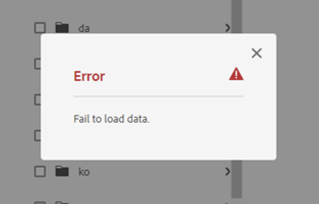

# Das Hinzufügen von Assets zu einem Übersetzungsauftrag schlägt mit dem Fehler &quot;Daten werden nicht geladen&quot;fehl

## Beschreibung {#description}

<b>Umgebung</b>
Experience Manager
<b>Problem/Symptome</b>
Versuch, Assets aus einem bestimmten Ordner zu einem <b>Übersetzungsauftrag</b> schlägt mit dem Fehler fehl - *Daten werden nicht geladen*.

## Auflösung {#resolution}

Nachdem das Problem lokal reproduziert wurde, wurde festgestellt, dass die Assets im Ordner, der die *Laden der Daten fehlgeschlagen* -Fehler beschädigt wurden, da beide `jcr:title` und `dc:title` Metadaten und `jcr:title` wurde definiert als <b>Mehrwert-Zeichenfolge</b>.

Der Eigenschaftstyp für `jcr:title` sollte <b>Zeichenfolge</b>. Da es als Zeichenfolgen-Array definiert wurde, trat ein Typumwandlungsfehler auf, wenn das Pfad-Asset aus dem Ordner geladen wurde.

Ändern des Typs von `jcr:title` auf Zeichenfolge zu setzen und den Titel mit dem Namen des Assets festzulegen, wird das Problem gelöst.
