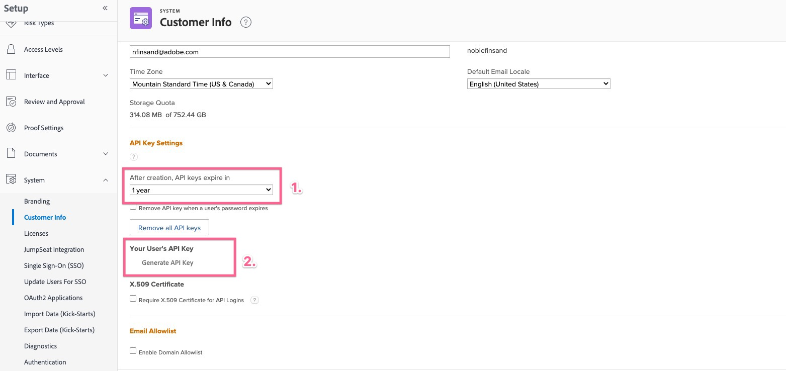
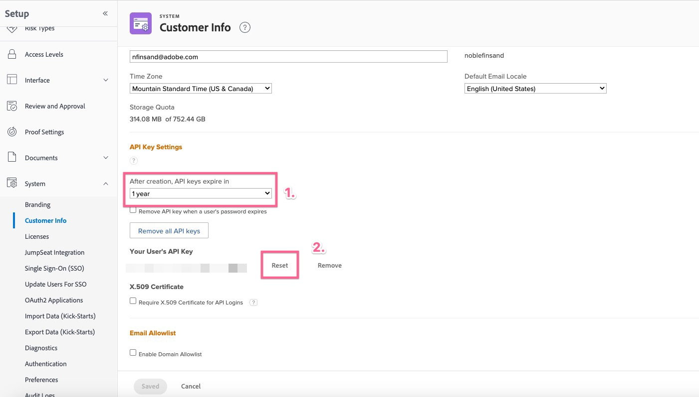

# Falscher Anforderungsfehler beim Konfigurieren des Workfront for Jira-Add-ons

## Beschreibung {#description}

<b>Umgebung</b> Workfront   <b>Problem/Symptome</b>
Beim Versuch, eine Verbindung zwischen Workfront und Jira herzustellen, wenn in Workfront kein gültiger API-Schlüssel für den Benutzer festgelegt wurde, ist ein Fehler mit einer falschen Anfrage aufgetreten.

## Auflösung {#resolution}

<b>Schritte zum Auflösen:</b>
1. Melden Sie sich bei der <b>Workfront</b>, möchten Sie die Verbindung mit als Benutzer herstellen.
2. Navigieren Sie zum <b>Einrichtung</b>.
   - Navigieren Sie zu <b>System</b> `>`  <b>Kundeninformationen</b> im <b>Workfront</b>.
   - Überprüfen Sie, ob *API-Schlüssel* ist im <b>API-Schlüsseleinstellungen</b> Abschnitt.
3. Wenn eine *API-Schlüssel* nicht vorhanden:
   - Legen Sie ein Ablaufdatum fest und klicken Sie auf <b>Erzeugen</b>.
4. Wenn bereits ein API-Schlüssel vorhanden ist:
   - Überprüfen Sie die Länge des Zeiteinsatzes vor der *-Schlüssel läuft ab* und klicken Sie auf <b>Zurücksetzen</b>.
5. Navigieren Sie zu <b>Jira</b> und versuchen Sie, eine erneute Verbindung zum <b>Workfront</b>.

<b>Relevante Links:</b>
- [Adobe Workfront für Jira konfigurieren](https://experienceleague.adobe.com/docs/workfront/using/adobe-workfront-integrations/workfront-for-jira/configure-workfront-for-jira.html?lang=en)
- [Verwalten von API-Schlüsseln in Workfront](https://experienceleague.adobe.com/docs/workfront/using/administration-and-setup/manage-wf/security/manage-api-keys.html?lang=en)

