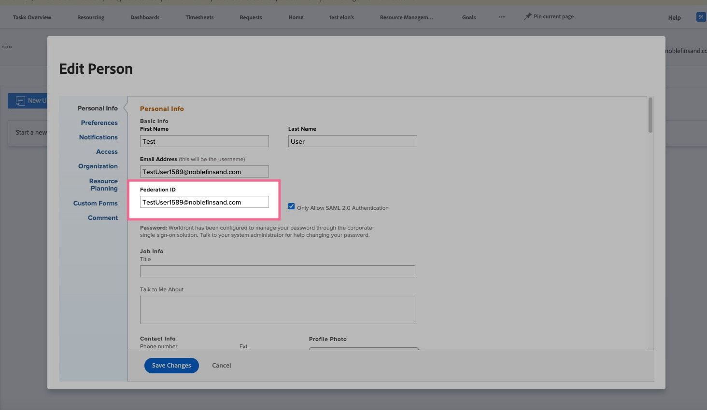

# Anmeldefehler als Benutzer ohne zugewiesene SSO (Single Sign-On)

## Beschreibung {#description}

### Umgebung

Workfront

### Problem/Symptome

Beim Versuch, sich über Workfront mit Single Sign-On (SSO) anzumelden, wird die Seite zur Anmeldeseite von Workfront umgeleitet. Auf der Webadressenleiste der Anmeldeseite wird eine Fehlermeldung mit der Meldung &quot;Benutzer nicht zugeordnet&quot;angezeigt.

## Auflösung {#resolution}

1. Navigieren Sie zu dem spezifischen Benutzer, der diesen Fehler in Workfront erhält:
   - [Benutzer bearbeiten](https://experienceleague.adobe.com/docs/workfront/using/administration-and-setup/add-users/create-manage-users/edit-a-users-profile.html?lang=en).
   - Wenn kein Benutzerkonto vorhanden ist, [Erstellen eines neuen Benutzers](https://experienceleague.adobe.com/docs/workfront/using/administration-and-setup/add-users/create-manage-users/add-users.html?lang=en) -Konto.
2. Stellen Sie sicher, dass für den Benutzer eine Föderations-ID aufgelistet ist:
   - Suchen Sie nach der Verband-ID.
3. Wenn die Föderations-ID leer ist, führen Sie die folgenden Schritte aus:.
   - Geben Sie die von Ihrem Identitätsanbieter bereitgestellte Föderations-ID des Benutzers ein (Groß-/Kleinschreibung beachten).
   - Klicken Sie auf <b>Speichern.</b>
   - Hinweis: Bei der Föderations-ID wird zwischen Groß- und Kleinschreibung unterschieden und muss genau mit der Art übereinstimmen, in der sie von Ihrem Identitäts-Provider an Workfront gesendet wird. Wenden Sie sich an Ihren Netzwerk- oder IT-Administrator, wenn Sie sich bezüglich der Föderations-ID oder der Groß-/Kleinschreibung nicht sicher sind.
   - Überprüfen Sie außerdem vor oder nach der Verband-ID auf zusätzliche Leerzeichen, da dies der Grund für diesen Fehler sein kann.

Optionale Schritte: Auditprotokolle

Verwenden Sie die Auditprotokolle in Workfront als Tool zur Fehlerbehebung, um zu untersuchen, was Ihr Identitäts-Provider bei dem fehlgeschlagenen Anmeldeversuch als Verband-ID (Name ID) weitergibt.

1. Klicken Sie auf <b>Einrichtung</b>
2. Zu System wechseln `>`  [Auditprotokolle](https://experienceleague.adobe.com/docs/workfront/using/administration-and-setup/add-users/create-manage-users/audit-logs.html?lang=en)
3. Anwenden von Filtern zur Anzeige fehlgeschlagener Anmeldeversuche
   - Filtern nach fehlgeschlagenen Anmeldeversuchen 
   - Klicken Sie auf <b>Übernehmen</b>.
4. Die vom Identitätsanbieter an Workfront übergebene Föderations-ID (Name ID) wird in der Detailspalte für den letzten fehlgeschlagenen Anmeldeversuch angezeigt.
   - Stellen Sie sicher, dass diese in der Detailspalte angezeigte Verband-ID genau mit der in Workfront als Verband-ID eingegebenen ID übereinstimmt (Groß- und Kleinschreibung beachten).

