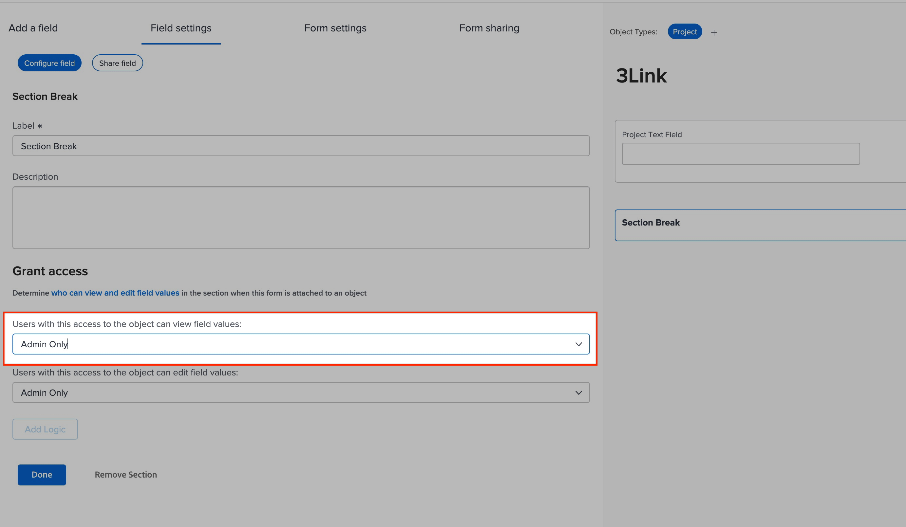
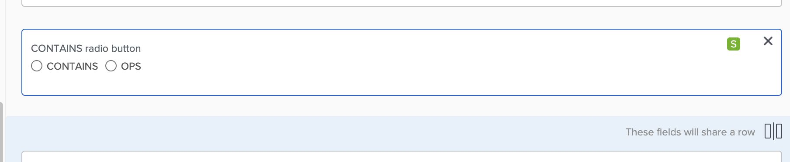

# Benutzerdefiniertes Feld wird nicht im Formular angezeigt

## Beschreibung {#description}

### <b>Umgebung</b>

Workfront

### <b>Problem/Symptome</b>

Ein Feld wurde einem benutzerdefinierten Formular hinzugefügt. Wenn Sie sich das Formular ansehen, ist das Feld jedoch nicht sichtbar.

## Auflösung {#resolution}

Um das Problem zu beheben, führen Sie die folgenden Schritte aus:

1. Stellen Sie sicher, dass das Feld im richtigen Formular vorliegt.
2. Überprüfen Sie, ob Abschnittsumbrüche vorliegen.

   - Wenn es Abschnittsumbrüche gibt, überprüfen Sie den benötigten Zugriff, um die Felder im Abschnitt anzuzeigen.                     
3. Überprüfen Sie das Formular auf Logik überspringen .                                                                                                                                               
   - Wenn die Logik zum Überspringen implementiert ist, warten die anderen Abschnitte darauf, dass die Logik zum Überspringen initiiert wird. Dadurch können diese Abschnitte/andere Felder ausgeblendet werden.
   - Auf dem Feld wird ein &quot;S&quot;-Symbol angezeigt, das angibt, dass in einem Feld die Logik zum Überspringen angegeben ist.
   - Wenn die Logik für den Trigger durch die Logik überspringen ausgeblendet wird, müssen die Benutzer die erforderlichen Felder ausfüllen. Andernfalls müssen Sie die Logik in Ihrem Formular möglicherweise neu konfigurieren.

<b>Verwandte Lesungen:</b>

- [Fügen Sie mit dem alten Formular-Builder Logik hinzu und überspringen Sie Logik zu einem benutzerdefinierten Formular](https://experienceleague.adobe.com/docs/workfront/using/administration-and-setup/customize/custom-forms/custom-form-builder/use-the-custom-form-builder/display-or-skip-logic-custom-form.html)
- [Hinzufügen eines Abschnittsumbruchs zu einem benutzerdefinierten Formular mit dem Legacy-Formular](https://experienceleague.adobe.com/docs/workfront/using/administration-and-setup/customize/custom-forms/custom-form-builder/use-the-custom-form-builder/add-a-section-break-to-a-custom-form.htm)

