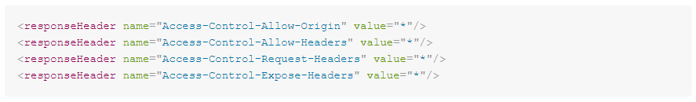
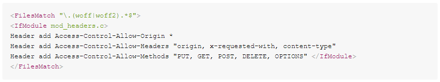

# Wie lässt sich ein Fehler bei der Verwendung von .woff- und .woff2-Erweiterungen beheben?

## Beschreibung {#description}


### Umgebung

Adobe Campaign Classic v7 (Version 7.2.2 - Build 9349)

### Problem/Symptome

Nachdem Sie .woff und .woff2 auf einer Mid-Instanz auf die Whitelist gesetzt und diese Dateierweiterungen in einer Web-App verwendet haben, wird der folgende Fehler ausgegeben:


```
Access to font at 'https://mkt-instance.campaign.adobe.com/res/mid-instance/file_example.woff2'
    from origin 'https://mkt-instance.campaign.adobe.com' has been blocked by 
    CORS policy: No 'Access-Control-Allow-Origin' header is present on the requested resource.
```


<u>Schritte zur Reproduktion</u>:

1. Greifen Sie mithilfe der Dateien .woff und .woff2 auf die URL der Webanwendung zu.
2. Öffnen Sie die Browser-Konsole Ihres Webbrowsers und bemerken Sie den Fehler für diese Dateien.


## Auflösung {#resolution}


1. Hinzufügen `Access-Control-Allow-Origin`, `Access-Control-Allow-Headers`und `Access-Control-Allow-Methods` als responseHeader unter dem Relais-Abschnitt des `serverConf.xml`:    
2. Hinzufügen `Access-Control-Allow-Origin`, `Access-Control-Allow-Headers`und `Access-Control-Allow-Methods` Kopfzeilen in `apache_neolane.conf` in beiden App-Containern:    


### Ursache

Der Fehler wird ausgegeben, da die Mid-Instanz die Konfiguration von `Access-Control-Allow-Origin`, `Access-Control-Allow-Headers`und `Access-Control-Allow-Methods` Kopfzeilen in `serverConf.xml` und `apache_neolane.conf`.
