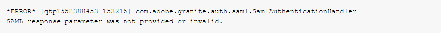

# SAML-Fehler - SAML-Antwortparameter wurde nicht angegeben oder ungültig

## Beschreibung {#description}

### Umgebung

Adobe Experience Manager

### Problem/Symptome

Beim Erstellen der SAML 2.0-Konfiguration zur Aktivierung der SSO-Anmeldung in der Produktionsautorin wurde eine Fehlermeldung von AEM erhalten. Dies erfolgte, nachdem der Azure-Provider die Anmeldung durchgeführt und das SAML-Token abgerufen hat, um die Authentifizierung auf der AEM durchzuführen.

Der folgende Fehler wird empfangen:

## Auflösung {#resolution}

Nach der Überprüfung der SAML-Konfiguration wurde festgestellt, dass Sie jedes Mal, wenn Sie versuchen, sich bei AEM Autor anzumelden, den 403-Fehler erhalten.

Fehler 403 wird normalerweise angezeigt, wenn der Apache Sling Referrer-Filter nicht aktiviert ist. Nach Überprüfung der Konfiguration für den Apache Sling Referrer-Filter wurde festgestellt, dass die <b>Leere erlauben</b> -Option nicht aktiviert wurde und auch kein Host hinzugefügt wurde <b>Hosts zulassen</b>.

Damit die SAML-Anmeldung funktioniert, muss der Hostname des Identitätsanbieters der OSGi-Konfiguration des Apache Sling Referrer Filters hinzugefügt werden.

Überprüfen Sie daher <b>Leere erlauben</b>und fügen Sie die Hosts hinzu, die den IdP-Provider darstellen <b>Hosts zulassen</b>.

Nach Abschluss dieser erforderlichen Schritte war die Anmeldung erfolgreich.

<b>Hinweis</b>: Die IDP-URL muss zur Konfiguration des Apache Sling Referrer Filters hinzugefügt werden, ohne das Protokoll einzuschließen, z. B. `aem-sso-saml` anstelle von `https://aem-sso-saml`
