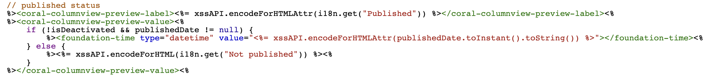
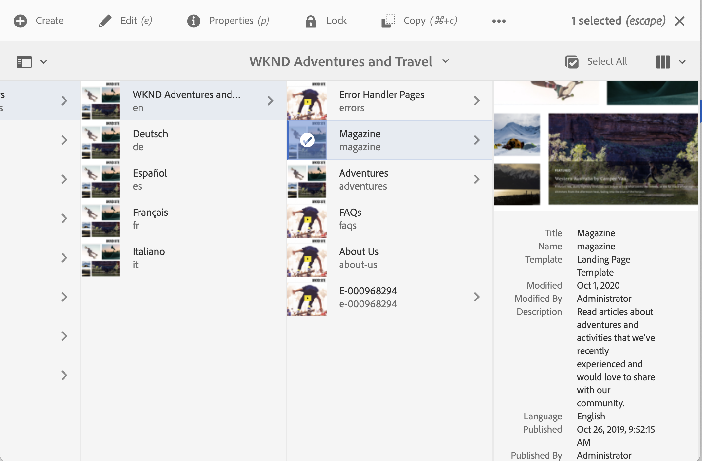
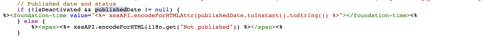
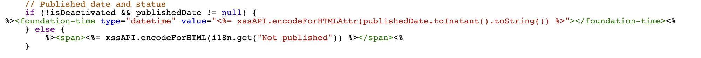
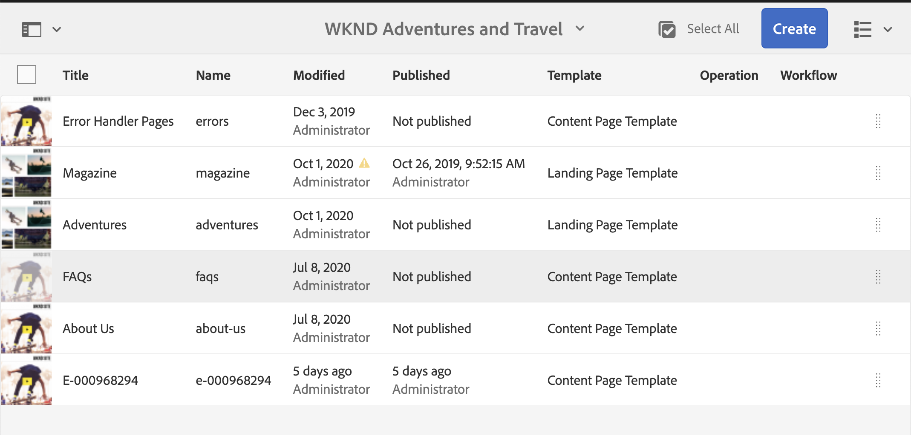

# Adobe Experience Manager: Anpassen des Anzeigeformats des auf der Sites-Konsole veröffentlichten Seitendatums

## Beschreibung {#description}

AEM Das Veröffentlichungsdatum der Seite wird in der Site-Konsole angezeigt, die Tageszeit wird jedoch nicht angezeigt.
In diesem Abschnitt wird erläutert, wie Sie das Datums-/Uhrzeitformat des veröffentlichten Datums so anpassen können, dass auch die Tageszeit einbezogen wird.

<b>Umgebungen</b>
AEM 6.5, AEM as a Cloud Service

## Auflösung {#resolution}

Erstellen Sie eine Überlagerung für jede Spalte und Listenansicht.

Für die Spaltenansicht wird /libs/cq/gui/components/coral/admin/page/columnpreview/columnpreview.jsp überlagert.
  Vorher

Nachher: Fügen Sie dem Foundation-Time-Tag das Attribut type=&quot;datetime&quot; hinzu.

Für die Listenansicht wird /libs/cq/gui/components/coral/admin/page/row/row.jsp überlagert.
  Vorher

Nachher: Fügen Sie dem Foundation-Time-Tag das Attribut type=&quot;datetime&quot; hinzu.

