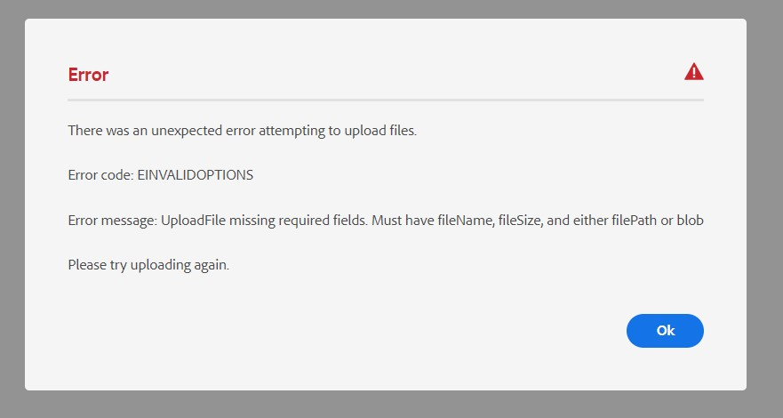

# Das Hochladen von Assets schlägt mit einer Fehlermeldung mit Masseninhalten fehl.

## Beschreibung {#description}

<br>Beschreibung<br><br>
<b>Umgebung</b>
Experience Manager as a Cloud Service

<b>Problem/Symptome</b>
Beim Hochladen mehrerer Assets in einen Ordner wird der folgende Fehler ausgegeben.




## Auflösung {#resolution}

Auflösung<br>


Dieser Fehler kann durch den Versuch verursacht werden, ein 0-Byte-Asset als eine der Bedingungen in der folgenden Funktion hochzuladen`[` 0`]`  nicht erfüllt.

Suchen Sie nach allen 0-Byte-Dateien oder den anderen Bedingungen, die in der folgenden Funktion beschrieben sind.`[` 0`]`

Nachdem Sie das 0-Byte-Asset aus dem Ordner, der die Assets enthält, entfernt haben, sollten die restlichen Assets erfolgreich hochgeladen werden.

Die erforderlichen Bedingungen beim Hochladen einer Datei haben folgende Eigenschaften:

1. fileName
2. fileSize
3. filePath
4. blob


`[` 0`]`


```none
function ensureRequiredOptions(options) {
                if(!options.fileName || !options.fileSize || (!options.filePath && (!options.blob || !options.blob.slice))) {
                    throw new UploadError('UploadFile missing required fields. Must have fileName, fileSize, and either filePath or blob', ErrorCodes.INVALID_OPTIONS);
                    }
            }
```

