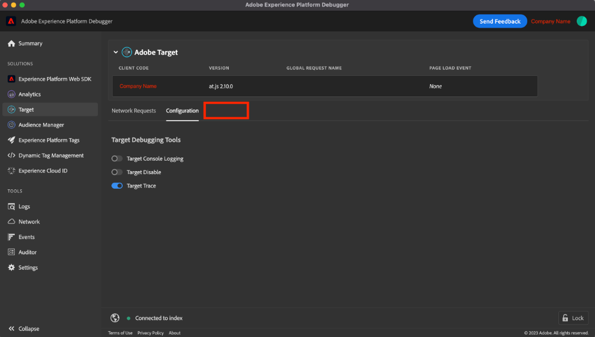

# &quot;Target Traces&quot;wird nicht im Adobe Experience Platform Debugger angezeigt

Wenn <b>Zielspuren </b>nicht in AEP Debugger angezeigt wird, müssen Sie sich bei einer Organisation anmelden, in der Adobe Target verwendet wird, und die <b>Target Trace </b>umschalten.

## Beschreibung {#description}

### Umgebung

- Adobe Experience Platform
- Adobe Target

### Problem/Symptome

Die <b>Zielspuren</b> nicht im Adobe Experience Platform Debugger angezeigt.

## Auflösung {#resolution}

Überprüfen Sie zunächst die folgenden Bedingungen:

- Der Benutzer muss sich bei einer Organisation anmelden, in der Adobe Target auf der Website verwendet wird.
- Die <b>Target Trace</b> Umschalten in <b>Target</b> `>`  <b>Konfiguration</b> `>`  <b>Target-Debugging-Tools</b> -Abschnitt aktiviert werden.

Wenn das Problem trotz der oben genannten Bedingungen weiterhin besteht, führen Sie die folgenden Schritte aus.

- Neues Browserprofil erstellen

  <u>Im Chrome-Browser</u>:

   1. Klicken Sie oben rechts auf das Profilsymbol und dann auf <b>Hinzufügen</b>.
   2. Installieren Sie die Adobe Experience Platform Debugger-Erweiterung für das neue Profil.
- Browsereinstellungen auf Standard zurücksetzen

  <u>Im Chrome-Browser</u>:

   1. Wählen Sie oben rechts <b>Mehr</b> und navigieren Sie zu <b>Einstellungen</b>.
   2. Auswählen <b>Einstellungen zurücksetzen</b> `>`  <b>Einstellungen auf ihre ursprünglichen Standardeinstellungen zurücksetzen</b> `>`  <b>Einstellungen zurücksetzen</b>.
   3. Nachdem die Einstellungen zurückgesetzt wurden, aktivieren Sie die Adobe Experience Platform Debugger-Erweiterung erneut.

