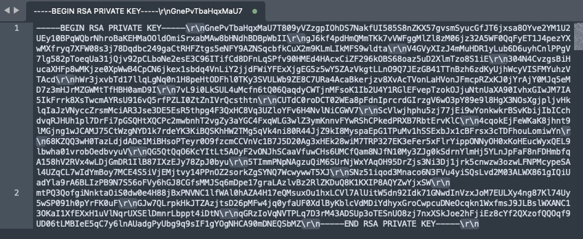

# Workfront Fusion: JWT-Verbindungsfehler für AEM Assets Fusion


Wenn beim Konfigurieren einer Verbindung für AEM Assets as a Cloud Service mithilfe des Fusion AEM Assets-Moduls ein JWT-Verbindungsfehler auftritt, überprüfen Sie, ob der private Schlüssel korrekt formatiert ist.

## Beschreibung {#description}


### Umgebung

- Adobe Workfront Fusion
- Adobe Experience Manager


### Problem/Symptome

Die Konfiguration der Verbindung für AEM Assets as a Cloud Service mithilfe des Fusion AEM Assets-Moduls kann zu folgendem Fehler führen:


```
Failed to verify connection 'My AEM Assets as a Cloud Service connection'. Function 'jwt' finished with error! error:1E08010C:DECODER routines::unsupported.
```


Dies wird normalerweise dadurch verursacht, dass der private Schlüssel nicht ordnungsgemäß formatiert wird.


## Auflösung {#resolution}


Führen Sie die folgenden Schritte aus, um den Fehler zu beheben:

1. Kopieren Sie den privaten Schlüssel in die von der Adobe Developer-Konsole heruntergeladene JSON-Datei und öffnen Sie ihn in einem Textbearbeitungsprogramm.
2. Im privaten Schlüssel (z. B. \r\n) sollten mehrere Wagenrückkehrzeichen aufgeführt sein, wie im folgenden Screenshot dargestellt.     
3. Löschen Sie alle Wagenrücklaufzeichen, unabhängig davon, wo sie im privaten Schlüssel angezeigt werden (z. B. \r\n), und ersetzen Sie sie durch einen manuellen Rücklauf.
4. Kopieren Sie nach Abschluss den privaten Schlüssel und fügen Sie ihn zusammen mit den anderen erforderlichen Informationen in das AEM Assets-Konfigurationsmodul in Fusion ein.


### Verwandte Informationen

- [Konfigurieren der AEM Assets-Verbindung in Fusion](https://experienceleague.adobe.com/docs/workfront/using/adobe-workfront-fusion/fusion-apps-and-modules/aem-assets-modules.html?lang=en)
- [Generieren von Zugriffstoken für serverseitige APIs](https://experienceleague.adobe.com/docs/experience-manager-cloud-service/content/implementing/developing/generating-access-tokens-for-server-side-apis.html?lang=de#the-server-to-server-flow)

