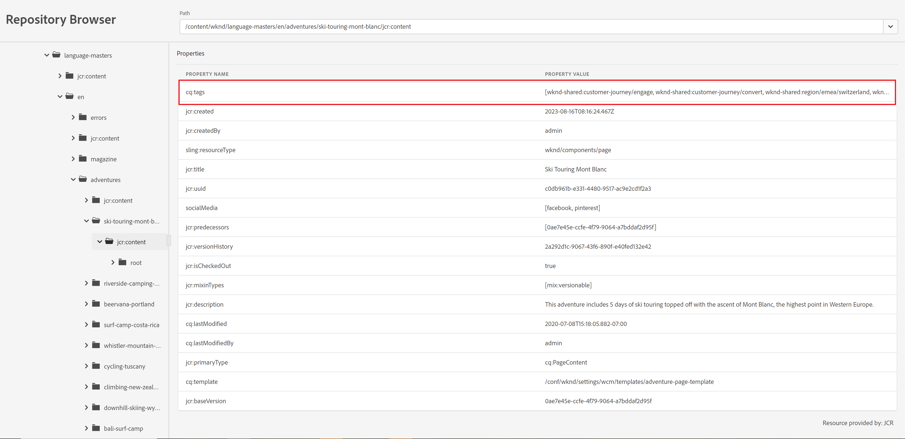

# Repository Browser zeigt keine vollständigen Werte der Eigenschaften an

<b>Umgebung:</b> <b>AEM as a Cloud Service</b>

<b>Problemzusammenfassung:</b> Der Repository-Browser zeigt nicht den vollständigen Wert einer Eigenschaft an, sehen Sie auch den angehängten Screenshot.

## Beschreibung {#description}

<b>Zu reproduzierende Schritte:</b> Wechseln Sie zum Repository-Browser einer Umgebung und überprüfen Sie einen Knoten, der über eine Eigenschaft mit vielen Werten verfügt.

<b>Erwartetes Verhalten:</b> Alle Werte der Eigenschaft sollten sichtbar sein

<b>Erlebnisverhalten:</b>  Die Liste der Werte der Eigenschaft wird ausgeschnitten. Die Einträge können nicht ausgewählt werden und wir können auch nicht nach rechts scrollen.

## Auflösung {#resolution}

Dieses Problem wird durch eine interne Jira-Anfrage als Produktfehler gemeldet.

Als Problemumgehung kann der Benutzer die URL durch Hinzufügen von bearbeiten.-1.json&#39; nach dem Inhalt, um eine JSON-Datei herunterzuladen, wodurch die Werte sichtbar werden - z. B.

https://author-pxxxxxx-eyyyyyy.adobeaemcloud.com/content/wknd/language-masters/en/adventures/ski-touring-mont-blanc/jcr:content.-1.json
