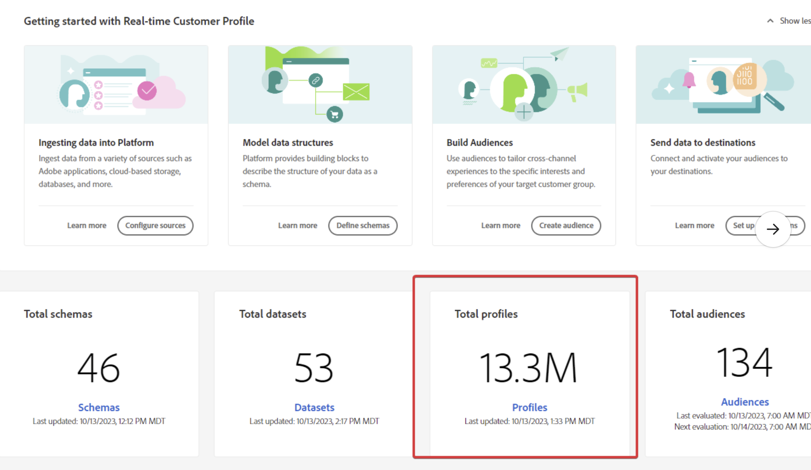

# AEP - Addressable audience in license usage section does not match profile count from home page

Addressable audience in license usage section does not match profile count from the home page.

## Beschreibung {#description}

Beim Experience Platform können Sie verschiedene Zahlen an verschiedenen Stellen sehen, z. B.:           Gesamtprofile auf der Startseite:             Addressable audience in License Usage:     

## Auflösung {#resolution}

Beachten Sie, dass sich die Berechnung für adressierbare Zielgruppen von der Gesamtzahl der Profile unterscheidet.

Die adressierbare Zielgruppe ist das Profil in seinem Speicher. <u>which</u> einer beliebigen Zusammenführungsrichtlinie, während das, was wir in einem Dashboard anzeigen (wie das Feld Gesamtprofil auf der Startseite), das Profil ist, das auf der standardmäßigen Zusammenführungsrichtlinie basiert.
