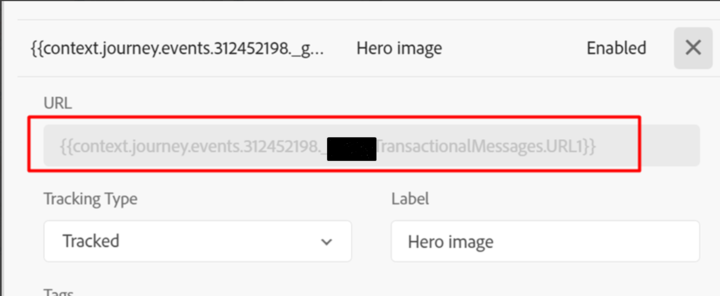

# Falsches Klickvolumen in AJO-E-Mail-Tracking-Daten

In diesem Artikel wird über eine der möglichen Ursachen für Diskrepanzen bei E-Mail-Tracking-Daten gesprochen.

## Beschreibung {#description}

### Umgebung

Adobe Journey Optimizer

### Problem/Symptome

Die E-Mail-Tracking-Statistiken von AJO weisen auf eine erhebliche Diskrepanz zwischen Klicks und Einzelöffnungen in unserer Transaktions-E-Mail-Journey hin. Dieses Klickvolumen scheint höchst unwahrscheinlich und lässt Bedenken hinsichtlich seiner Genauigkeit aufkommen.

## Auflösung {#resolution}

Dies ist ein erwartetes Verhalten, wenn die Variable <b>URL</b> enthält einen Wert, der nicht als gültige URL gilt. Der folgende Screenshot veranschaulicht Folgendes:

Um Diskrepanzen zwischen Klicks und Einzelöffnungen in einer ähnlichen Situation zu vermeiden, schließen Sie die statische <b>URL</b> in die E-Mail ein und geben Sie den dynamischen Teil über das Ereignisattribut an.
