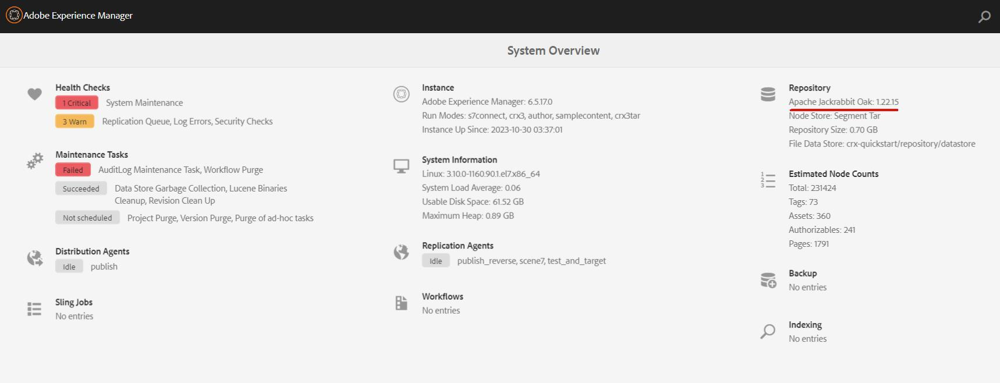

# Adobe Experience Manager: So erhalten Sie das Oak-Run-Tool für Ihre AEM-Version

## Beschreibung {#description}

Das Oak-run-Tool verfügt über verschiedene Anwendungsfälle bei der AEM, z. B. die Konsistenzprüfung des Datenspeichers und Indexverwaltung.
 In diesem Artikel wird erläutert, wie Sie das Oak-run-Tool abhängig von der AEM erhalten.
     
<b>Umgebungen</b> 
AEM 6.5

## Auflösung {#resolution}

Schritt 1. Navigieren Sie zu Tools `>`  Aktivitäten `>`  Systemübersicht zum Angeben der Version von Apache Jackrabbit Oak in Ihrer AEM

Schritt 2. Zugriff auf das Oak-run-Repository

[https://repo1.maven.org/maven2/org/apache/jackrabbit/oak-run/](https://repo1.maven.org/maven2/org/apache/jackrabbit/oak-run/)

Schritt 3. Laden Sie das neueste Oak-Run-Tool herunter, dessen Nebenversion von Apache Jackrabbit Oak identisch ist.

Beispiel: Apache Jackrabbit Oak: 1.22.15, verwenden Sie das neueste Oak-Run-Tool der Version 1.22.x.
