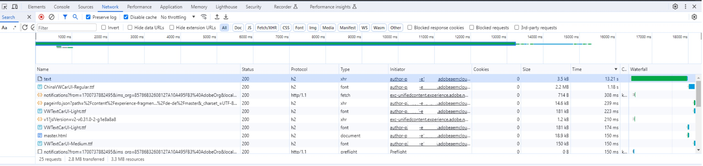
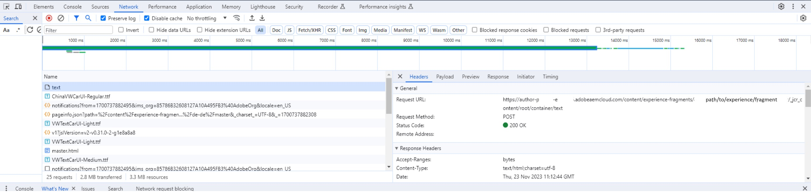

# Leistungsprobleme beim Bearbeiten von Inhalten


Um Leistungsprobleme beim Bearbeiten von Inhalten zu beheben, überprüfen Sie in der Browser-Entwicklerkonsole, welche Anforderung am zeitaufwendigsten ist, und überprüfen Sie die Anforderungs-URL. Aktualisieren Sie dann auf eine Version, die AEM SDK-Version 2023.9.13665 oder höher entspricht.

## Beschreibung {#description}


### Umgebung

AEM as a Cloud Service

Version: AEM SDK v2023.8.13206 oder höher

### Problem/Symptom(e)

Bei der Bearbeitung von Seiten können Leistungsprobleme auftreten, wenn Sie eine AEM SDK-Version haben, die älter als Version 2023.9.13665 ist.

Beispielsweise kann das Hinzufügen einer einzelnen Textkomponente in einem neuen und leeren Experience Fragment bis zu 15 Sekunden dauern, bis die Seite wieder verwendet werden kann. Die Seite reagiert nicht mehr, wartet auf etwas und wird irgendwann aktualisiert.


## Auflösung {#resolution}


### Fehlerbehebung

Überprüfen Sie in der Browser-Entwicklerkonsole, welche die zeitaufwendigste Anforderung ist, und überprüfen Sie die Anforderungs-URL.

Für das obige Beispiel:





Suchen Sie im Fehlerprotokoll des Autors nach dem Pfad in der Anforderungs-URL - z. B. `/content/experience-fragments/path/to/experience/fragment/_jcr_content/root/container/text`

### Auflösung

Nach der Überprüfung der Protokolle ist festzustellen, dass der Grund für die Verzögerung <b>`[` 1`]` </b>. Die `ProcessorUtils` wartet, bis der Auftrag im Index enthalten ist, was abhängig vom Repository-Status einige Zeit in Anspruch nehmen kann. Im Durchschnitt beträgt die minimale Wartezeit 5 bis 7 Sekunden und dann die Zeit, die für die Ausführung des Auftrags benötigt wird.

Dies ist ein bekanntes Problem, das unter den internen Jiras - SITES-14804 und GRANITE-45493 - verfolgt wird. Trotzdem wurde eine Korrektur implementiert, die in Oak Version 1.54 enthalten war - <b>`[` 2`]` </b>.

Oak 1.54 war in AEM SDK-Version 2023.9.13665 enthalten.

Daher muss die Umgebung, in der dieses Problem auftritt, auf eine Version aktualisiert werden, die mindestens 2023.9.13665 entspricht, um dieses Verhalten zu vermeiden.

`[` 1`]`


```
author    aemerror    23.11.2023 11:12:44.432    WARN    [  [ 1700737951330]  POST /content/experience-fragments/path/to/experience/fragment/_jcr_content/root/container/text HTTP/1.1]  com.adobe.cq.updateprocessor.impl.ProcessorUtils Deferred job availability; took 13011ms to become available through index.
```


`[` 2`]`

[Jackrabbit Oak/OAK-10265](https://issues.apache.org/jira/browse/OAK-10265)
