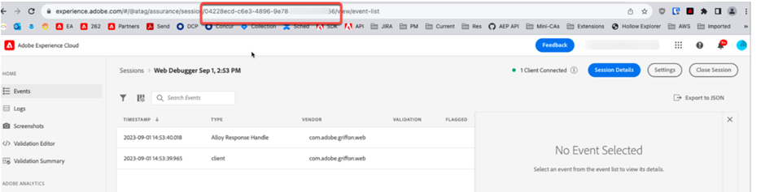

# Wie Entwickler Zuverlässigkeitsprotokolle über API anzeigen können


In diesem Artikel wird beschrieben, wie Entwickler die Zuverlässigkeitsprotokolle über API anzeigen können.

## Beschreibung {#description}


### Umgebung

Adobe Experience Platform Assurance

### Problem/Symptom(e)

Wie kann das Entwicklerteam die Zuverlässigkeitsprotokolle über die API anzeigen?


## Auflösung {#resolution}


Führen Sie die folgenden Schritte aus, um diese Anfrage zu erfüllen:

1. Melden Sie sich bei Assurance mit [dieser Link](https://experience.adobe.com/assurance).
2. Rufen Sie die Sicherungs-ID aus der URL ab, wie unten dargestellt:

   
3. Verwenden Sie die folgende Curl-Anfrage, um die API-Anfrage zu senden. Ersetzen Sie die `ASSURANCE_ID` -Parameter mit der obigen Zuverlässigkeitskennung.<br>


   ```
   curl --location --request POST 'https://server.adobedc.net/ee/v2/interact?dataStreamId= <YOUR_DATASTREAM_ID>&debugSessionId=<ASSURANCE_ID>'
   ```


4. Die API-Antwort enthält die Zuverlässigkeitsprotokolle.


Wenden Sie sich bei weiteren Fragen an die Kundenunterstützung .
