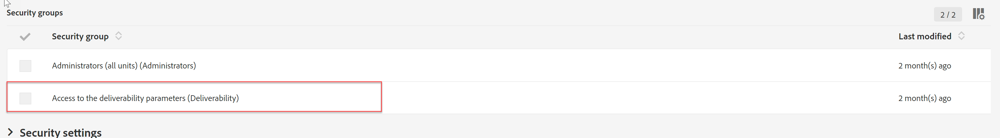

# Die Branding-Konfiguration in ACS kann nicht bearbeitet werden

Der Artikel bietet eine Lösung für das Campaign Standard-Problem, bei dem Sie die Branding-Konfiguration in ACS nicht bearbeiten können. Möglicherweise müssen Sie überprüfen, ob Sie dem <b>Zugriff auf die Zustellbarkeitsparameter</b> Sicherheitsgruppe und erhalten Sie die Zuweisung, wenn nicht.

## Beschreibung {#description}

### Umgebung

Adobe Campaign Standard

### Problem/Symptome

Sie können die Branding-Konfiguration in Adobe Campaign Standard nicht bearbeiten.

## Auflösung {#resolution}

Um die Markenkonfiguration zu bearbeiten, rufen Sie die <b>Administratoren</b> Sicherheitsgruppe reicht nicht aus

Überprüfen Sie Ihren Zugriff auf die Instanz unter dem Pfad: <b>Administration </b>`>`  <b>Benutzer</b> und <b>Sicherheit </b>`>`  <b>Benutzer</b>. Stellen Sie unter Sicherheitsgruppen sicher, dass Sie dem <b>Zugriff auf die Zustellbarkeitsparameter</b> Sicherheitsgruppe.

Nachdem Sie dieser Gruppe zugewiesen wurden, sollten Sie die Markenkonfiguration bearbeiten können.

