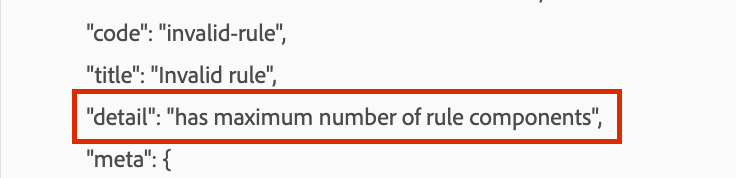

# Experience Platform Datenerfassung - Fehler beim Hinzufügen eines benutzerspezifischen Ereignisses zu einer Regel &quot;hat maximale Anzahl von Regelkomponenten&quot;

Beim Hinzufügen von Ereignissen zu einer Regel in einer Experience Platform-Datenerfassungseigenschaft wird der Fehler &quot;hat die maximale Anzahl von Regelkomponenten&quot;angezeigt.

## Beschreibung {#description}

*Tags in Adobe Experience Platform folgen einem regelbasierten System
 Ereignisse (If): Das Ereignis ist das Ereignis, nach dem die Regel suchen soll. Dies wird durch die Auswahl eines Ereignisses, etwaiger Bedingungen und Ausnahmen definiert.*

Sie versuchen, eine Bedingung (Ereignis) zu einer Eigenschaftsregel hinzuzufügen, die bereits eine hohe Anzahl dieser Bedingungen aufweist, aber beim Speichern Ihrer Änderungen einen Fehler erhält, wie im folgenden Screenshot dargestellt

## Auflösung {#resolution}

Es gibt eine Beschränkung von etwa 100 Ereignissen/Bedingungen, die Sie in einer Datenerfassungsregel in Adobe-Tags hinzufügen können.

Allgemein besteht jedoch Einigkeit darüber, dass eine derart große Anzahl von Regelbedingungen sehr ungewöhnlich ist und die derzeitige Grenze wahrscheinlich nicht angehoben werden wird. Wenn Sie dies wirklich benötigen, würden wir die Verwendung von benutzerdefiniertem Code und einer select case-Anweisung empfehlen.
