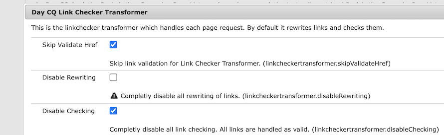

# Adobe Experience Manager: Umgehen der URL-Validierung für Sonderzeichen durch den LinkChecker

## Beschreibung {#description}

  Eine benutzerdefinierte Komponente muss möglicherweise einen Link mit Sonderzeichen rendern, die für eine URL ungültig sind. Selbst wenn die Option &quot;Überprüfung deaktivieren&quot;in der LinkChecker-Konfiguration auf &quot;true&quot;gesetzt ist, validiert der LinkChecker den Link weiterhin und entfernt ihn aus der gerenderten HTML.         Beispiel:  Ein Link, der die Zeichen &quot;{&quot;und &quot;}&quot;enthält, die für eine URL nicht gültig sind.   `<` span`>` `<` a href=&quot;{testURL}&quot;`>` TEST-URL`<` /a`>` `<` /span`>`      Der LinkChecker entfernt den Link von der gerenderten HTML.  `<` span`>` `>` TEST-URL`<` /span`>`      Eine URISyntaxException wird dann als Folge dieses Validierungsprozesses in error.log protokolliert.     23.01.2024 12:43:34.500 \*WARN\* `[` 000 000 000 000 `[` 1705981414300`]`  GET /content/wknd/language-masters/en/test.html HTTP/1.1`]`  com.day.cq.rewriter.linkchecker.impl.LinkCheckerImpl Ignoring malformed URI: java.net.URISyntaxException: Illegales Zeichen im Pfad bei Index 0: {testURL}  In diesem Artikel wird erläutert, wie Sie die URL-Validierung umgehen und den Link intakt halten     <b>Umgebungen</b>  AEM as a Cloud Service, AEM 6.5.17    

## Auflösung {#resolution}

Fügen Sie das Attribut &quot;x-cq-linkchecker=&quot;skip&quot;&quot;zum Link in der HTL Ihrer Komponente hinzu. Dieses Attribut weist den LinkChecker an, die URL-Validierung vollständig zu umgehen.   Beispiel: Ein Link, der die für eine URL ungültigen Zeichen &quot;{&quot;und &quot;}&quot;verwendet.  `<` span`>` `<` a x-cq-linkchecker=&quot;skip&quot; href=&quot;{testURL}&quot;`>` TEST-URL`<` /a`>` `<` /span`>`    Der Link verbleibt auf der gerenderten HTML. `<` span`>` `<` a x-cq-linkchecker=&quot;skip&quot; href=&quot;{testURL}&quot;`>` TEST-URL`<` /a`>` `<` /span`>`    